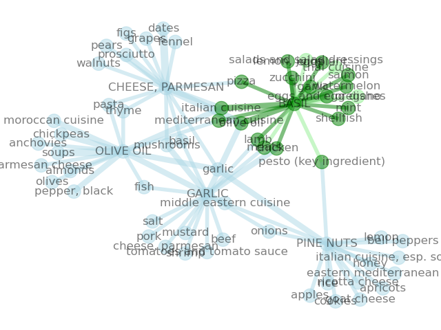

### Flavor Metrics/Gastronomical Map Project

Building a way to visualize The Flavor Bible, and develop flavor metrics to aid in recipe creation, menu development, and crop cycles.  



The primary purpose of this tool is to help chefs discover and experiment with 
flavor combinations where their mistakes are cheap.  This tool also has purpose 
in that looking at food through the flavor lense specifically, where cliques form 
and concepts converge, can help assist a wide range of users:
* *farmers* and *growers*
* *baristas* and *bartenders*
* *stores* and *distributers*
* *chefs* and *homecooks*
* *brewers* and *vitners*

0. [buy the ebook](https://karenandandrew.com/books/the-flavor-bible/) and read it

1. parse the epub files from the book into json format
```
python ./build_database.py
```
which generates `bible.json`.  The numbers in the json represent 
an integral distance rank of an ingredients importance to its 
source, and is based on the different typefaces used in the book.

We assume these html chapter files live in ./input/.

2. build the dataframes (pandas)
```
python construct_dataframes.py
```

3. visualize a similarity heatmap from a list of input ingredients
```
python heatmap.py
```

4. visualize similarity graph (networkx) from a list of input ingredients
```
python visualize_graph.py
```

Pickle files of the dataframes are generated and stored in the source 
directory `*.pkl`.  Use `'./run-all.sh` to build `bible.json` and datframes 
which are both needed for visualization.

## TODO

* the similarity matrix calculation can be done better than what is being
done currently
* rules for parsing the book and trimming its outfile were not combined 
into one, because it may be useful to keep as much grammar in tact for
cullinary context, and using the dataframe tool to get things more 
data-friendly for visualization
* graph playground really whould be done in javascript, so the nodes have hover
text, ability to input queries, just navigate the whole set in general 
