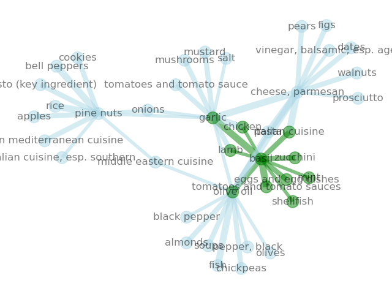
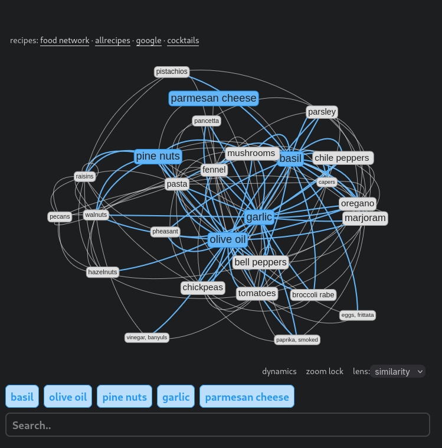

## Flavor Project

Building a way to visualize [The Flavor Bible](https://karenandandrew.com/books/the-flavor-bible/), and develop flavor metrics to aid in recipe creation, menu development, and wine pairings.  

### Audience

The primary purpose of this tool is to help chefs discover and experiment with 
flavor combinations where their mistakes are cheap.  This tool also has purpose 
in that looking at food through the flavor lense specifically, where cliques form 
and concepts converge, can help assist a wide range of users:

* *farmers* and *growers*
* *baristas* and *bartenders*
* *stores* and *distributers*
* *chefs* and *homecooks*
* *brewers* and *vitners*

### Demo

[Demo](https://flavorpair.me) ● [Prototype](https://brege.org/post/the-flavor-network/)

[Purchase the book](https://karenandandrew.com/books/the-flavor-bible/)

### Install

Requires Python 3.11+ and [uv](https://docs.astral.sh/uv/):

``` bash
uv sync
source .venv/bin/activate
```

### Overview

Run the complete pipeline:
``` bash
python main.py
```

Outputs all data to `data/`:

- `bible.json` - Raw parsed ingredient relationships
- `clean.json` - Normalized and cleaned data
- `similarity.json` - Jaccard similarity matrix (9.3MB)
- `nodes.json` - Network nodes for visualization
- `edges.json` - Network edges for visualization

### Pipeline

The data processing pipeline requires a few intermediate steps to turn the book into a usable, weighted data set that can be visualized.

0. [Purchase the book](https://karenandandrew.com/books/the-flavor-bible/)

1. parse the epub files from the book into json format
``` bash
python src/pipeline/parse.py
```
which generates `data/bible.json`. The numbers in the json represent an integral distance rank of an ingredient's importance to its source, and is directly based on the different impact typefaces used in the book.

We assume these html chapter files live in `input/bible/`.

2. clean up the json, which outputs a better weighted `clean.json`
``` bash
python src/pipeline/clean.py data/bible.json data/clean.json
```

3. compute the similarity matrix in the jaccard metric, which makes a larger `similarity.json`
``` bash
python src/pipeline/similarity.py -i data/clean.json -o data/similarity.json
```

4. create the network graph data:
``` bash
python src/pipeline/graph.py data/clean.json data/edges.json data/nodes.json
```

5. slice the graph:
``` bash
python tools/slice.py -i data/nodes.json -e data/edges.json -n 'basil' -n 'garlic' -n 'olive oil'
```

6. generate a similarity heatmap from a list of input ingredients
``` bash
python tools/heatmap.py -n 'basil' -n 'garlic' -n 'olive oil'
```

7. visualize ingredient networks
``` bash
python tools/visualize.py -n 'basil' -n 'garlic'
```

### Visualize

The preset nodes in `visualize.py` are the five ingredients of pesto.
``` bash
python tools/visualize.py -o docs/img/pesto.png --no-show
```




That's just a quick and dirty preview without leaving Python. For an interactive visualization, see the [demo at https://flavorpair.me](https://flavorpair.me)!


